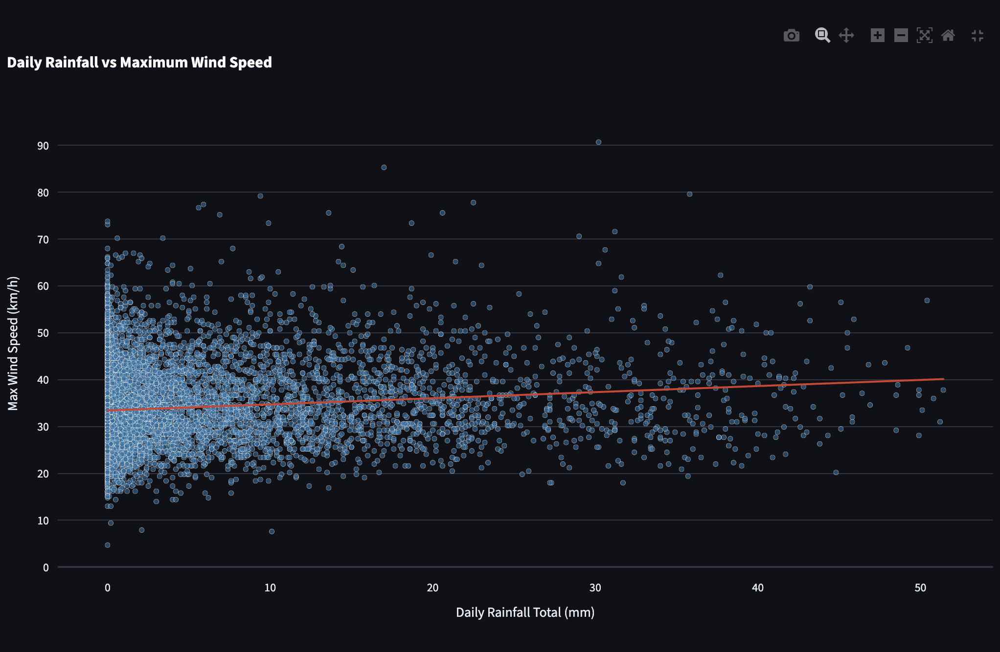
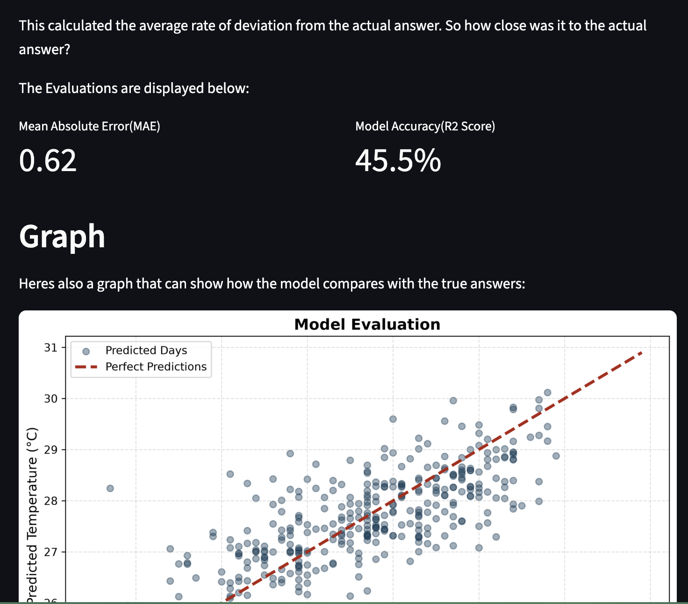

# Weather Analysis
Analyzing Singapores Weather!





# About
This project analyzes [Singapores Weather Data](https://github.com/chuachinhon/weather_singapore_cch). Looking
at trends between years and comparing different properties of the data.

## Tabel of contents
* Yearly Temperature - this looks at how the average temperture each year changes
* Rainfall vs Temperature - testing to see if more rainfall leads to lower temperatures
* Rainfall vs Wind Speed - testing to see if mroe rainfall leads to higher winds on average
* Prediction - Created a model to predict temperatures
* Predicting Temperatures - Input features for your model day and have the model predict it's temperature!

# Motivation
This project was done for [Horizons Arcana](https://horizons.hackclub.com/) being held in Singapore.
Naturally needing an idea, why not use Singapores own weather data lol.

I've done similar data science projects a year or two ago, and this project was also a way for me to refresh
on that knowledge too!

# Tech stack
Everything here was coded using Python. All the data analysis and iniital graphs was done with Jupyter Notebooks, the notebooks are present in the `notebooks` folder. 

For displaying the data, streamlit is the obvious solution. Thats present in the `streamlit` folder.

Othet than that some other folders:

1. `dataset`: Stores CSV & JSON files
2. `media`: Stores static graphs
3. `screenshots`: Screenshots of the app for the README
4. `models`: Stores the models

I also used plotly for the interactive graphs present

# Getting started

The project is hosted on Streamlit Cloud. Click [Here](https://singapore-weather-analysis.streamlit.app/) for the link.

# Setting it up yourself

## Setting it up

1. Clone the repository
```bash 
git clone https://github.com/danizdes/exoplanet-analysis```

2. When your in the repository, create a virtual environment
```bash
python -m venv env```

3. Activate it

On Linux/Macos:

```bash
source env/bin/activate```

On windows:

```bash
env\Scripts\activate```

Once you've installed it up install the requirements file

```bash
pip install -r requirements.txt```

## Running the code

Now go over to all the notebooks present in the `notebooks` directory and run all the cells one by one. The order doesn't matter.
If you want to use a newer version of weather data replace the `dataset/weather_clean.csv` file with a newer version. Keeping in mind
to keep the format of the file.

## Running the Site

Now in the terminal simply run:

```bash
streamlit run streamlit/Introduction.py```

**Ensure you run this from the base directory!**

And there you go!

# AI Usage

All the code was coded by myself. While I used AI for feedback and debugging(encountered errors, etc) or when I needed to know more about exactly how
a library that I wasnt familiar with worked, even then, I still never just copy pasted any code but used it as a reference, similar to looking
at documentation.